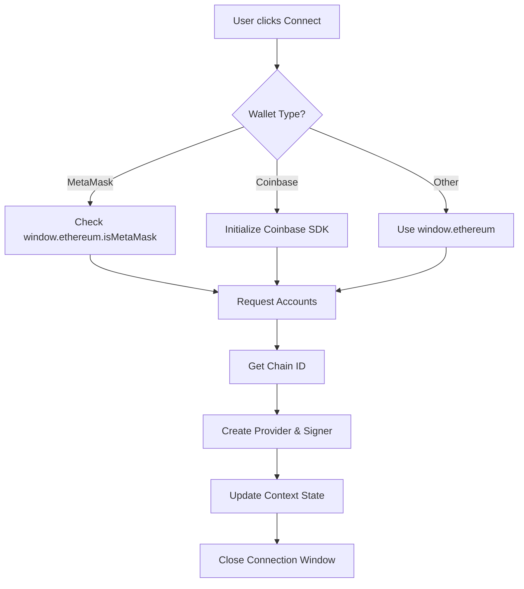

# Reputar Front 🎨

> Windows 98-styled Web3 frontend for the Reputar AI decentralized reputation system

A nostalgic retro interface built with modern Web3 technologies, featuring multi-wallet support and real-time blockchain interaction.

## 🌟 Features

### Core Functionality
- 🔐 **Multi-Wallet Integration**: MetaMask, Coinbase Wallet SDK, and EIP-1193 compatible wallets
- 🤖 **Agent Registration**: Register AI agents with metadata on-chain
- ⭐ **Rating System**: Rate agents from -100 to 100
- 📊 **Live Leaderboard**: Real-time reputation rankings
- 🔄 **Auto-Reconnection**: Remembers previous wallet connections
- 🌐 **Network Detection**: Automatic network identification and switching

### UI/UX
- 🎨 **Windows 98 Aesthetic**: Authentic retro design with modern functionality
- 🖥️ **Desktop Icons**: Classic desktop interface
- 📱 **Responsive Design**: Works on all screen sizes
- ⚡ **Real-time Updates**: Live wallet status in taskbar
- 🎯 **Quick Actions**: Dropdown menu for wallet operations

## 🚀 Quick Start

### Prerequisites

- Node.js 18+ and npm
- A Web3 wallet (MetaMask, Coinbase Wallet, etc.)

### Installation

```bash
# Navigate to the frontend directory
cd reputar-front

# Install dependencies
npm install

# Run development server
npm run dev

# Build for production
npm run build

# Start production server
npm start
```

The application will be available at [http://localhost:3000](http://localhost:3000)

## 📁 Project Structure

```
reputar-front/
├── app/                    # Next.js app directory
│   ├── layout.tsx         # Root layout with WalletProvider
│   ├── page.tsx           # Main desktop interface
│   └── globals.css        # Global styles
├── components/            # React components
│   ├── AgentRegister.tsx  # Agent registration form
│   ├── DesktopIcon.tsx    # Desktop icon component
│   ├── RateAgent.tsx      # Agent rating interface
│   ├── ReputationDashboard.tsx  # Leaderboard view
│   ├── Taskbar.tsx        # Windows 98 taskbar
│   ├── WalletConnect.tsx  # Wallet connection UI
│   └── Window.tsx         # Window component
├── contexts/              # React contexts
│   └── WalletContext.tsx  # Wallet state management
├── types/                 # TypeScript definitions
│   └── wallet.d.ts        # Wallet-related types
├── utils/                 # Utility functions
│   └── contracts.ts       # Contract addresses and ABIs
├── public/                # Static assets
│   └── ai-brain-logo.png  # App logo
└── package.json           # Dependencies and scripts
```

## 🔧 Configuration

### Contract Addresses

Update the deployed contract addresses in `utils/contracts.ts`:

```typescript
export const AGENT_REGISTRY_ADDRESS = "0xYourAgentRegistryAddress";
export const REPUTATION_HUB_ADDRESS = "0xYourReputationHubAddress";
```

### Wallet SDK Configuration

The Coinbase Wallet SDK is configured in `contexts/WalletContext.tsx`:

```typescript
const coinbaseWallet = new CoinbaseWalletSDK({
  appName: 'Reputar AI',
  appLogoUrl: '/ai-brain-logo.png'
});
```

## 🎮 Components

### WalletContext

Global state management for wallet connections.

**Features:**
- Multi-wallet support (MetaMask, Coinbase, generic)
- Auto-reconnection on page load
- Account and network change detection
- Error handling and user feedback

**Usage:**
```typescript
import { useWallet } from '../contexts/WalletContext';

function MyComponent() {
  const { 
    address, 
    isConnected, 
    provider, 
    signer, 
    connect, 
    disconnect 
  } = useWallet();
  
  // Your component logic
}
```

### WalletConnect

Wallet connection interface with selection menu.

**Features:**
- Three wallet options (MetaMask, Coinbase, Other)
- Connection status display
- Network information
- Auto-close on successful connection

### Taskbar

Windows 98-style taskbar with wallet status indicator.

**Features:**
- Start menu with app shortcuts
- Live clock
- Wallet status with dropdown menu
- Quick actions (copy address, disconnect)

### AgentRegister

Agent registration form.

**Features:**
- Metadata URI input
- Transaction status feedback
- Wallet connection check
- Error handling

### RateAgent

Agent rating interface.

**Features:**
- Agent reputation lookup
- Rating submission (-100 to 100)
- Transaction confirmation
- Real-time feedback

### ReputationDashboard

Leaderboard displaying all agents and their scores.

**Features:**
- Sortable by average score
- Agent metadata display
- Refresh functionality
- Mock data fallback

## 🌐 Supported Networks

The frontend supports all EVM-compatible networks:

| Network | Chain ID | Display Name |
|---------|----------|--------------|
| Ethereum Mainnet | 1 | Ethereum |
| Sepolia | 11155111 | Sepolia Testnet |
| Polygon | 137 | Polygon |
| Base | 8453 | Base |
| Base Sepolia | 84532 | Base Sepolia |
| Custom | * | Chain ID: X |

## 🎨 Styling

### Technologies
- **Tailwind CSS 4**: Utility-first CSS framework
- **98.css**: Windows 98 component library
- **Custom CSS**: Retro styling enhancements

### Key Classes
```css
.shadow-out      /* Outset shadow for buttons */
.inset-shadow    /* Inset shadow for inputs */
.active          /* Active button state */
.vertical-text   /* Vertical text for sidebar */
```

## 🔐 Wallet Integration

### Supported Wallets

1. **MetaMask** 🦊
   - Browser extension
   - Most popular Ethereum wallet
   - Auto-detected if installed

2. **Coinbase Wallet** 🔵
   - Browser extension or mobile
   - Embedded wallet via SDK
   - QR code connection support

3. **Other Wallets** 🔌
   - Any EIP-1193 compatible wallet
   - WalletConnect support
   - Generic provider interface

### Connection Flow



## 📦 Dependencies

### Core
- **next**: 16.0.3 - React framework
- **react**: 19.2.0 - UI library
- **react-dom**: 19.2.0 - React DOM renderer

### Web3
- **ethers**: 6.15.0 - Ethereum library
- **@coinbase/wallet-sdk**: 4.2.3 - Coinbase Wallet integration

### Styling
- **tailwindcss**: 4 - CSS framework
- **98.css**: 0.1.21 - Windows 98 styling

### Development
- **typescript**: 5 - Type safety
- **eslint**: 9 - Code linting

## 🧪 Testing

### Manual Testing Checklist

- [ ] Wallet connection (MetaMask)
- [ ] Wallet connection (Coinbase)
- [ ] Wallet disconnection
- [ ] Agent registration
- [ ] Agent rating
- [ ] Reputation viewing
- [ ] Network switching
- [ ] Auto-reconnection
- [ ] Error handling
- [ ] Responsive design

### Browser Compatibility

- ✅ Chrome/Chromium
- ✅ Firefox
- ✅ Safari
- ✅ Edge
- ✅ Brave

## 🚀 Deployment

### Vercel (Recommended)

```bash
# Install Vercel CLI
npm i -g vercel

# Deploy
vercel
```

### Docker

```dockerfile
FROM node:18-alpine
WORKDIR /app
COPY package*.json ./
RUN npm install
COPY . .
RUN npm run build
EXPOSE 3000
CMD ["npm", "start"]
```

### Environment Variables

Create a `.env.local` file:

```env
NEXT_PUBLIC_AGENT_REGISTRY_ADDRESS=0x...
NEXT_PUBLIC_REPUTATION_HUB_ADDRESS=0x...
```

## 🐛 Troubleshooting

### Common Issues

**Issue**: `localStorage is not defined`
- **Solution**: Ensure Coinbase SDK is initialized client-side only (already fixed in WalletContext)

**Issue**: Wallet not connecting
- **Solution**: Check browser console for errors, ensure wallet extension is installed

**Issue**: Transactions failing
- **Solution**: Verify contract addresses are correct and deployed on the current network

**Issue**: Mock data showing instead of real data
- **Solution**: Connect wallet and ensure contracts are deployed

## 📈 Performance

### Optimization Techniques
- Server-side rendering (SSR) with Next.js
- Code splitting and lazy loading
- Optimized images and assets
- Minimal bundle size
- Efficient re-renders with React Context

### Metrics
- First Contentful Paint: < 1s
- Time to Interactive: < 2s
- Bundle size: ~500KB (gzipped)

## 🔒 Security

### Best Practices
- No private keys stored
- All transactions user-approved
- Input validation on all forms
- XSS protection via React
- HTTPS required for production

## 📝 License

MIT License - See LICENSE file for details

## 🤝 Contributing

1. Fork the repository
2. Create a feature branch
3. Make your changes
4. Test thoroughly
5. Submit a pull request

## 📚 Resources

- [Next.js Documentation](https://nextjs.org/docs)
- [Ethers.js Documentation](https://docs.ethers.org/)
- [Coinbase Wallet SDK](https://docs.cloud.coinbase.com/wallet-sdk/docs)
- [Tailwind CSS](https://tailwindcss.com/docs)

---

Built with ❤️ using Next.js, React, and Web3 technologies
